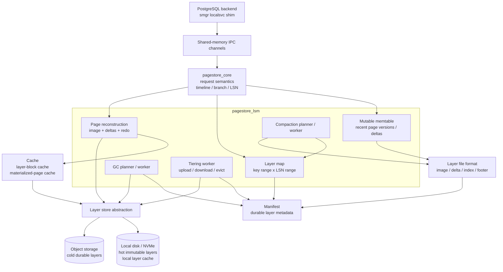
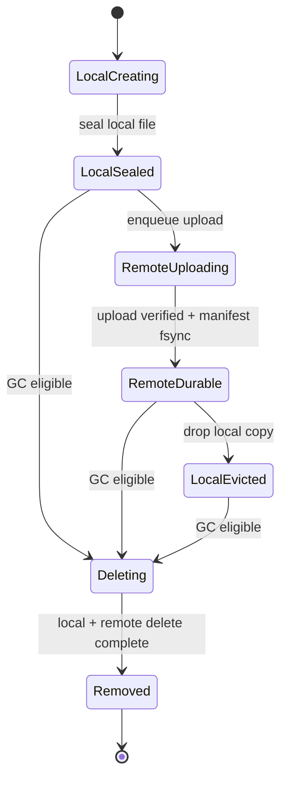
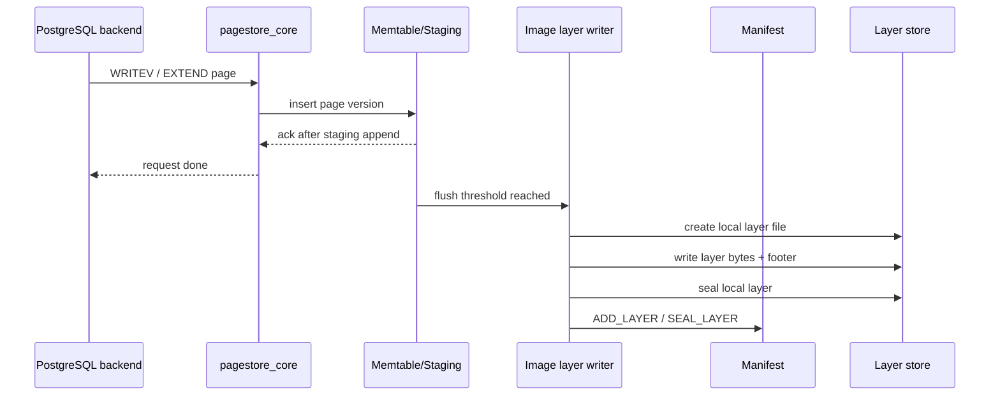
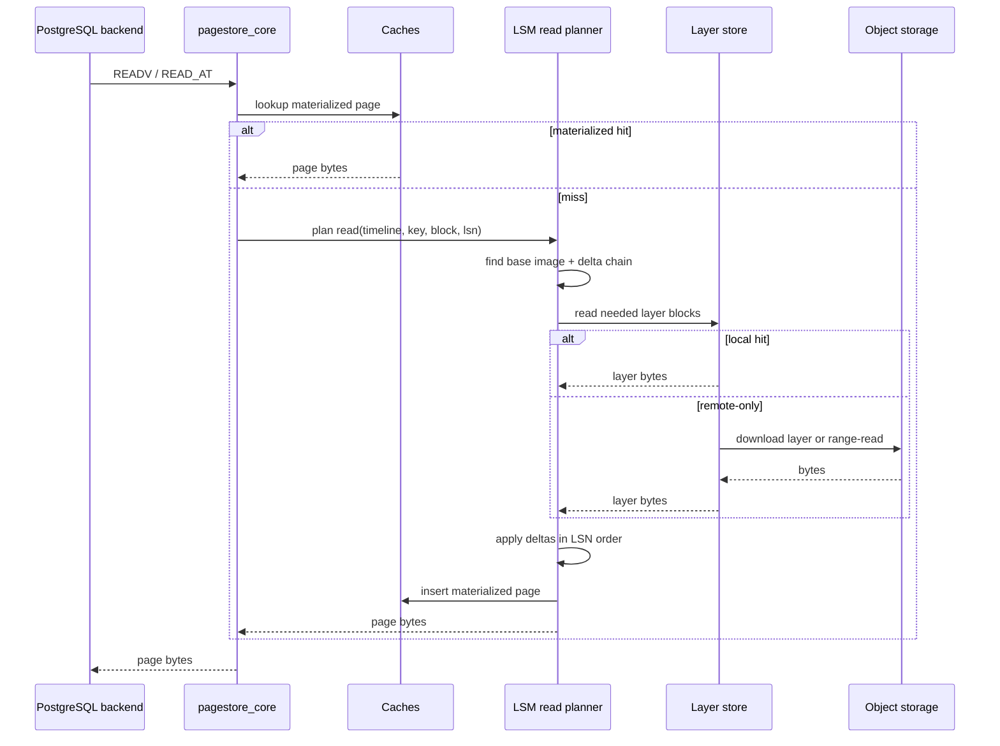
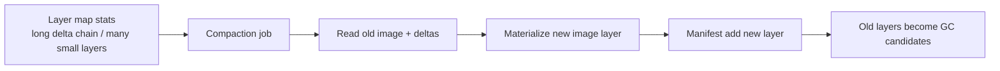
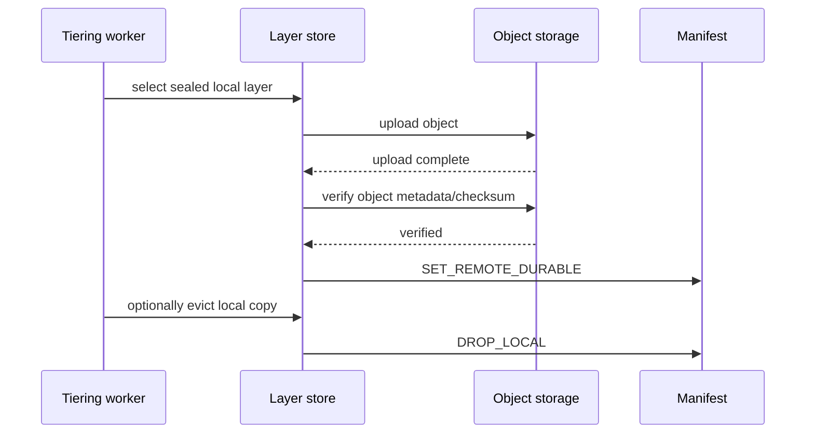
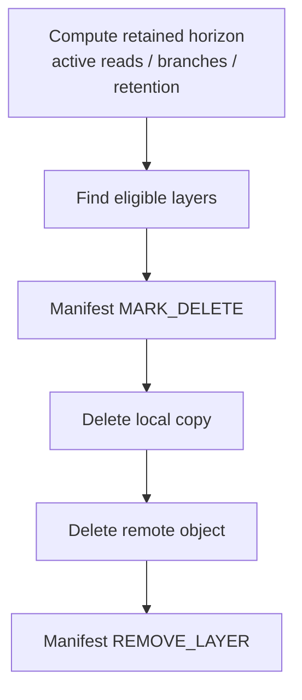
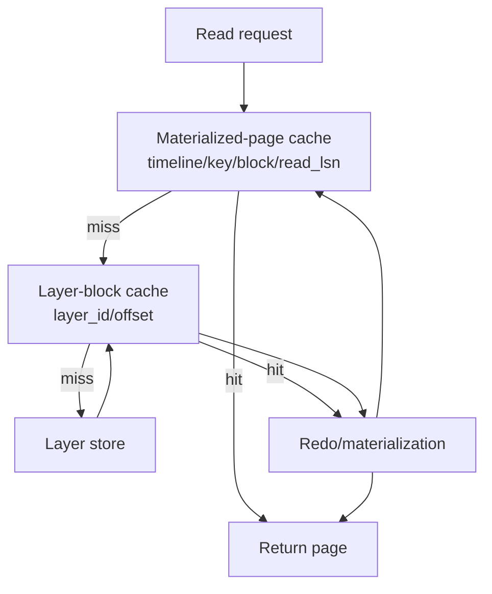
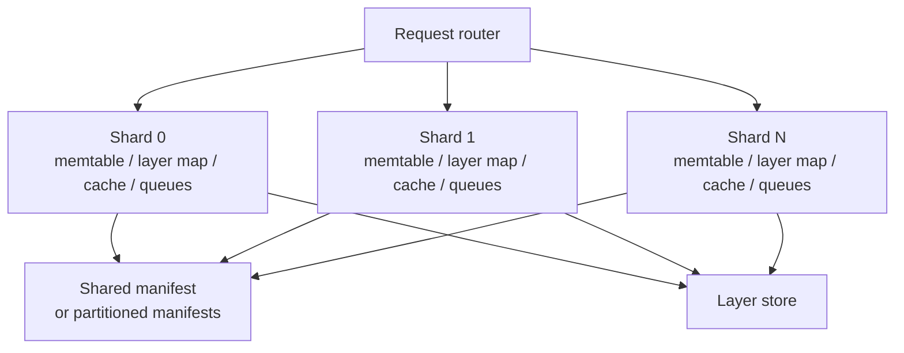

# pagestore LSM-like architecture

This document describes the intended LSM-like architecture for `contrib/pagestore`.
It complements `LSM_OBJECT_STORAGE_PLAN.md`: that document is the phased plan;
this document is the target architecture and module boundary reference.
See `MATERIALIZATION.md` for the deployment-agnostic ingest/materialize
abstraction (page-ingest vs wal-ingest, and where redo runs: local worker vs
cloud serverless) that this layer model plugs into.

## Design intent

The pagestore daemon should evolve from an append-only page-version log into a
layered page server:

- writes land in a mutable in-memory/staging layer;
- flush creates immutable image or delta layers;
- reads reconstruct a page from a base image plus ordered deltas;
- compaction bounds redo chains and layer count;
- object storage stores the cold durable copy of immutable layers;
- local disk/NVMe acts as hot storage and cache for active layers.

The architecture keeps PostgreSQL-facing semantics stable while changing the
daemon's internal storage organization.

## High-level architecture



## Module boundaries

### PostgreSQL-facing shim

Existing responsibility:

- translate smgr operations into pagestore IPC requests;
- preserve PostgreSQL-facing page semantics;
- avoid depending on LSM internals.

The shim should not know about layer files, object storage, compaction, or GC.

### `pagestore_core`

Responsibility:

- request handling;
- timeline and branch semantics;
- LSN-aware reads;
- fork metadata;
- coordination between IPC operations and the LSM layer.

It should not directly open layer files or object objects.  It should call the
LSM/layer-store API.

### `pagestore_lsm`

Responsibility:

- memtable ownership;
- layer map lookup;
- read planning;
- flush planning;
- compaction planning;
- GC eligibility;
- coordination with manifest and layer store.

This is the semantic center of the new storage architecture.

### `pagestore_manifest`

Responsibility:

- durable layer metadata;
- layer lifecycle state transitions;
- crash recovery of layer map;
- durable record of remote durability and deletion state.

The manifest is the authority.  Object-storage listing is not authority for
normal startup.

### `pagestore_layer`

Responsibility:

- immutable layer descriptors;
- image and delta layer file format;
- sparse indexes;
- checksums;
- footer parsing;
- future compression/filter metadata.

Layer files are immutable after seal.

### `pagestore_layer_store`

Responsibility:

- physical byte access for logical layers;
- local file/NVMe reads;
- future object-storage downloads and range reads;
- local eviction;
- remote delete.

The layer store hides physical placement from the LSM core.

### `pagestore_tiering`

Responsibility:

- upload sealed layers to object storage;
- mark layers remote durable after verification;
- evict local copies only after remote durability is durable in the manifest;
- download remote-only layers into local cache.

Tiering is asynchronous and should not be required for commit latency.

## Data model

### Logical key

The logical data key is:

```text
(timeline, tablespace, database, relfilenode, fork, block)
```

Timeline and branch semantics remain part of the page-server layer.  A branch can
share parent layers until it writes new versions.

### Image layer

An image layer stores materialized page bytes:

```text
key range
LSN point or range
records: (key, block, page_lsn, page bytes)
```

Image layers are the base for reads.

### Delta layer

A delta layer stores redo inputs:

```text
key range
LSN range
records: (key, block, record_lsn, delta / WAL reference)
```

Delta layers are applied above an image layer in LSN order.

### Manifest layer state



Required invariant:

```text
local copy may be evicted only after RemoteDurable is recorded in manifest
```

## Write path

First implementation keeps full-page writes:



Later delta-layer implementation:

```text
WAL ingest -> mutable delta staging -> sealed delta layer -> manifest
```

Unsupported redo cases can fall back to full-page image materialization.

## Read path



Read selection rule:

```text
nearest image layer at or before read_lsn
+ all delta layers covering (image_lsn, read_lsn]
```

If a child timeline lacks a page version, the planner walks to the parent
timeline as of the branch LSN.

## Compaction path



Compaction goals:

- bound per-page redo chain length;
- reduce small layer count;
- improve read locality;
- create image layers that allow older deltas to be GC'd.

Compaction must be install-new-before-delete-old.  Old layers remain readable
until the manifest durably exposes the replacement.

## Tiering path



Object storage is a cold durable tier.  It should not be in the foreground write
ack path.

## GC path



GC must be idempotent.  If the daemon crashes after `MARK_DELETE`, restart
continues deleting until `REMOVE_LAYER` is durable.

## Cache architecture



The layer-block cache is the lower physical cache.  The materialized-page cache
is the higher semantic cache and becomes most valuable once delta replay exists.

## Local and remote storage roles

```text
local storage:
  hot sealed layers
  mutable staging
  downloaded remote layers
  cacheable layer blocks

object storage:
  cold durable immutable layers
  remote copy of compacted historical state
  source of recovery when local copy is evicted
```

Local storage is allowed to be incomplete after a layer is remote durable.
Object storage is allowed to be eventually cleaned by GC, but only after manifest
state and retention rules permit deletion.

## Sharding model

See `SHARDING.md` for the detailed shard-by-key design, shared-state handling,
client-side routing, and the behavior-preserving migration plan.

Later multi-core implementation should shard by logical key:



Each shard should own its hot-path data structures.  Cross-shard state should be
limited to manifest coordination, object-store clients, and scheduling.

## Crash consistency rules

Required ordering:

```text
write local layer bytes
fsync local layer
write manifest ADD/SEAL
fsync manifest
```

For remote durability:

```text
upload remote object
verify checksum/size
write manifest REMOTE_DURABLE
fsync manifest
only then allow local eviction
```

For deletion:

```text
write manifest MARK_DELETE
fsync manifest
delete local / remote physical data
write manifest REMOVE_LAYER
fsync manifest
```

These rules ensure restart never trusts a layer that was not durably installed,
and never loses the only copy of a readable layer.

## First architecture milestone

The first milestone is local-only full-page image layers:

- manifest exists and replays into a layer map;
- layer descriptors can record local and future remote locations;
- layer store abstraction exists;
- writes can still use the old segment path;
- no object API is required yet;
- no delta redo is required yet.

This milestone is intentionally architectural.  It creates the seams needed for
image layers, object storage, compaction, GC, and later sharding without forcing
all of those changes into one implementation step.

